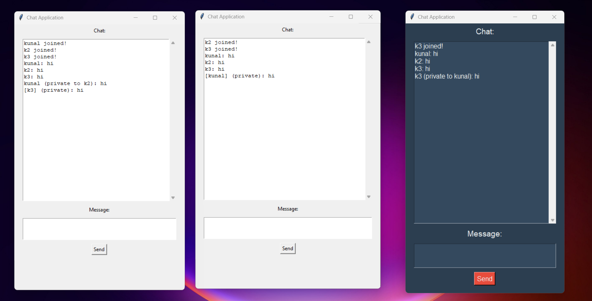

# Multi-User Encrypted Chat Application

A multi-user client-server chat application with private messaging and end-to-end encryption using Python.

## Features
- **End-to-End Encryption**: Messages are encrypted using the Fernet symmetric encryption.
- **Multi-User Support**: Multiple clients can connect and chat simultaneously.
- **Private Messaging**: Send direct messages to specific users.
- **GUI and CLI Clients**: Includes both graphical and command-line clients.

## Screenshot


## Installation
1. **Clone the repository**  
   ```sh
   git clone https://github.com/abnes30/chatbot.git
   cd chatbot
   ```

2. **Install dependencies**  
   ```sh
   pip install cryptography
   ```

## Running the Application
### Start the Server
Run the server to handle client connections.
```sh
python serverm.py
```

### Run a Client (CLI Version)
```sh
python clientm.py
```

### Run the GUI Client
```sh
python clientgui.py
```

For a dark-themed GUI, run:
```sh
python clientdark.py
```

## Usage
1. Start the server (`serverm.py`).
2. Launch one or more clients (`clientm.py` for CLI, `clientgui.py` for GUI).
3. Choose a nickname and start chatting.
4. To send a private message, type:
   ```
   @ username Your message here
   ```


